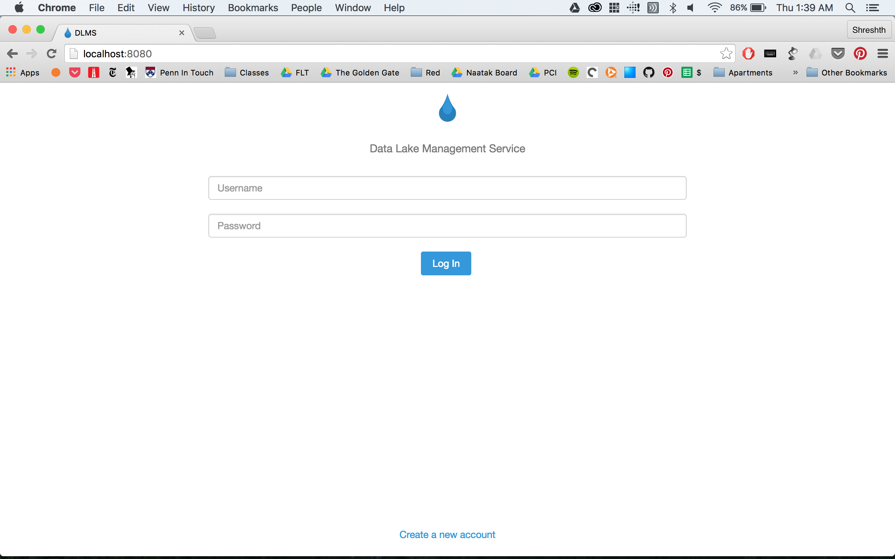

# DLMS
CIS 450 Final Project: Data Lake Management System

### How to run the app locally?

* Step 1:

Get the app secret and aws info. There are 2 files. `secret.json` contains the app secret. This must be put in a directory named `json` at the top level of the repository. `credentials` contains the AWS keys. This must be added to your computer as `~/.aws/credentials` on Mac/Linux or `C:\Users\USERNAME\.aws\credentials` on Windows.

* Step 2:

Then do this: 
```
$ sudo npm install
$ nodemon
```

### What does the app look like?

 

 