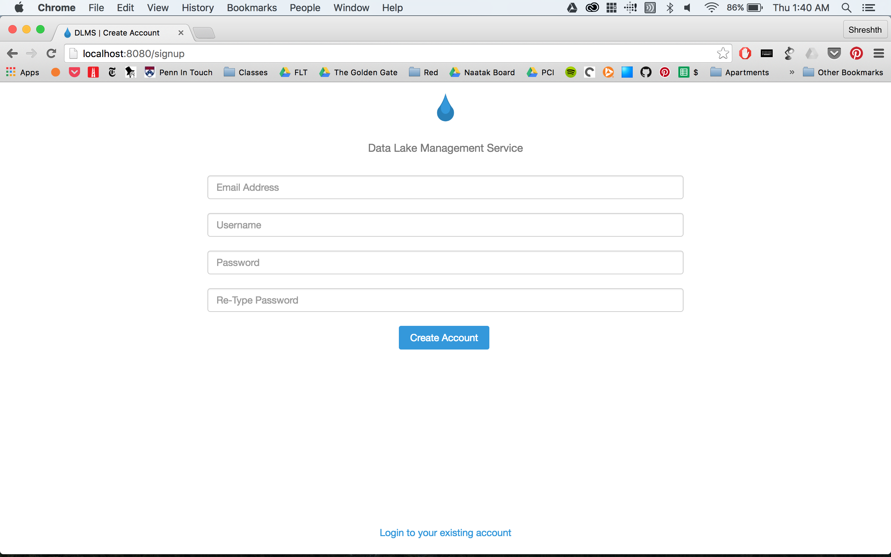

# DLMS
CIS 450 Final Project: Data Lake Management System

### How to run the app locally?

First be sure to have access to the json folder. Shreshth can send this to you. Then do this: 
```
$ sudo npm install
$ nodemon
```

### What does the app look like?

 

 